# Lista de Exercícios Unidade 1
## Questões

1. **(Nicoletti, 2018)** Para cada um dos três grafos $G=(V,E)$, encontre $V$, $E$, todas as arestas paralelas, todos os loops, todos os vértices isolados, e diga se $G$ é um grafo simples. Diga também a quais vértices $e_1$ é incidente.
    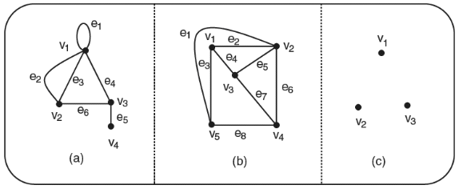

2. **(Nicoletti, 2018)** Dê três exemplos de grafos bipartidos diferentes dos apresentados neste livro. Especifique os conjuntos de vértices disjuntos.

3. **(Nicoletti, 2018)** Verifique se cada um dos grafos a seguir é bipartido. Se o grafo em questão for bipartido, especifique os conjuntos disjuntos de vértices.
    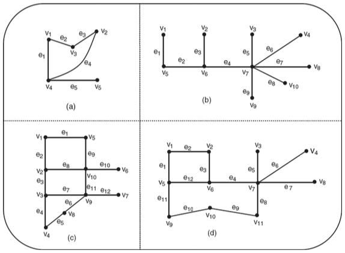

4. **(Nicoletti, 2018)** Justifique cada uma das afirmações a seguir:
- (a) Todo grafo é seu próprio subgrafo.
- (b) Um subgrafo de um subgrafo de $G$ é um subgrafo de $G$.
- (c) Um único vértice em um grafo $G$ é um subgrafo de $G$.
- (d) Uma única aresta de $G$, junto com os seus vértices-extremidade, é também um subgrafo de $G$. Os próximos exercícios (5 a 13) fazem referência aos grafos apresentados no enunciado.

Os próximos exercícios (5 até 13) fazem referência aos seguintes grafos:

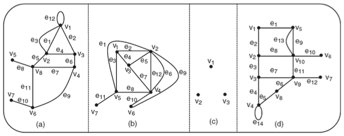

5. **(Nicoletti, 2018)** Especifique três subgrafos spanning para cada um dos grafos (a), (b), (c) e (d).
      > **Definição**: um subgrafo spanning (ou subgrafo gerador) de $G=(V,E)$ é um subgrafo $H=(V_H,E_H)$ tal que $V_H=V$. Ou seja, mantém todos os vértices de $G$ e pode escolher qualquer subconjunto das arestas.

6. **(Nicoletti, 2018)** Para os quatro grafos (a), (b), (c) e (d):
- (a) Defina os subgrafos $G-v_3$.
- (b) Defina os subgrafos $G-U$, em que $U=\{v_1,v_3\}$.

7. **(Nicoletti, 2018)** Para os três grafos (a), (b) e (d):
- (a) Defina os subgrafos $G-e_2$.
- (b) Defina os subgrafos $G-F$, em que $F=\{e_2,e_4,e_7\}$.

8. **(Nicoletti, 2018)** Construa o grafo básico simples de (a), (b), (c) e (d).

9. **(Nicoletti, 2018)** Para os grafos (a), (b) e (d), construa os subgrafos induzidos $G[U]$, para $U=\{v_1,v_3,v_5,v_6\}$, e $G[F]$, para $F=\{e_1,e_2,e_6,e_8\}$.

10. **(Nicoletti, 2018)** Para cada um dos grafos (a), (b) e (d), construa dois pares de subgrafos disjuntos e dois pares de subgrafos aresta-disjuntos.

11. **(Nicoletti, 2018)** Para cada um dos grafos (a), (b) e (d), dê exemplos das operações:
- (a) União de subgrafos.
- (b) Interseção de subgrafos.
- (c) Soma de dois subgrafos.
- (d) Complemento de subgrafo com $n$ vértices com relação a $K_n$.
      > Definição: o complemento de um grafo simples $G=(V,E)$ é $\overline{G}=(V,\overline{E})$, em que $\overline{E}=\{\{u,v\}:u,v\in V,\ u\neq v,\ \{u,v\}\notin E\}$. Ou seja, são todas as arestas possíveis do grafo $G$, menos as que já existem.

12. **(Nicoletti, 2018)** Construa uma decomposição para cada um dos grafos (a), (b) e (d).
      > **Definição**: Uma decomposição de um grafo $G$ é uma família de subgrafos $\{H_1,\ldots,H_k\}$ tal que $E(H_i)\cap E(H_j)=\emptyset$ para $i\neq j$ e $\bigcup_{i=1}^k E(H_i)=E(G)$. Ou seja, as arestas de $G$ são particionadas entre os subgrafos.

13. **(Nicoletti, 2018)** Para cada um dos grafos (a), (b), (c) e (d), construa um novo grafo, resultado da fusão de dois vértices do grafo original.

14. **(Nicoletti, 2018)** Discuta as propriedades comutativas da união, interseção e soma de subgrafos de um grafo $G$.

15. **(Nicoletti, 2018)** Verifique, usando as definições, que, se $G_1$ e $G_2$ são aresta-disjuntos, então $G_1 \cap G_2$ é o grafo nulo e $G_1 \oplus G_2 = G_1 \cup G_2$.

16. **(Nicoletti, 2018)** Verifique, usando as definições, que, se $G_1$ e $G_2$ são vértice-disjuntos, então $G_1 \cap G_2 = \emptyset$.

17. **(Nicoletti, 2018)** Verifique que, para qualquer grafo $G$, $G \cup G = G \cap G = G$ e $G \oplus G$ é o grafo nulo.

18. **(Nicoletti, 2018)** Determine se os grafos $G_1$ e $G_2$ a seguir são isomorfos. Se $G_1$ e $G_2$ forem isomorfos, escreva as funções $f$ e $g$ que estabelecem o isomorfismo. Caso contrário, forneça um invariante que os grafos não compartilham.
      > Adotaremos informalmente que dois grafos são isomorfos quando têm a mesma estrutura de conexões, diferindo apenas na nomeação dos vértices; isto é, há uma correspondência um a um entre vértices que preserva quem é vizinho de quem.
- (a)
    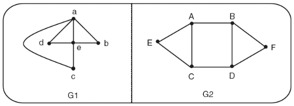
- (b)
    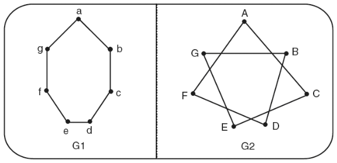
- (c)
    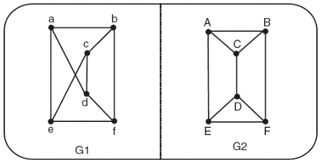
- (d)
    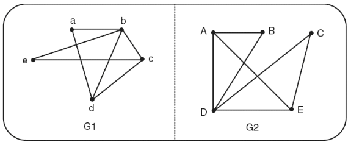
- (e)
    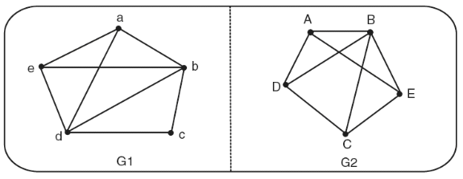
- (f)
    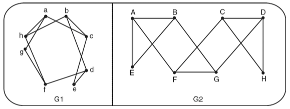
- (g)
    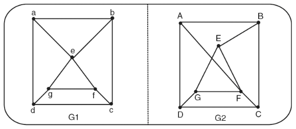
- (h)
    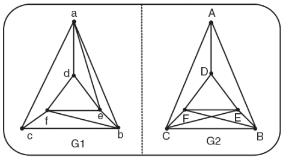
- (i)
    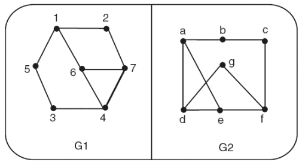
Para os exercícios 19 a 27, desenhe o grafo com a propriedade solicitada ou, então, explique por que tal grafo não existe.

19. **(Nicoletti, 2018)** Seis vértices, cada um com grau $3$.

20. **(Nicoletti, 2018)** Cinco vértices, cada um com grau $3$.

21. **(Nicoletti, 2018)** Quatro vértices, cada um com grau $1$.

22. **(Nicoletti, 2018)** Seis vértices e quatro arestas.

23. **(Nicoletti, 2018)** Quatro arestas, quatro vértices tendo graus $1,2,3,4$.

24. **(Nicoletti, 2018)** Quatro vértices com graus $1,2,3,4$.

25. **(Nicoletti, 2018)** Grafo simples; seis vértices tendo graus $1,2,3,4,5,5$.

26. **(Nicoletti, 2018)** Grafo simples; cinco vértices tendo graus $2,3,3,4,4$.

27. **(Nicoletti, 2018)** Grafo simples; cinco vértices tendo graus $2,2,4,4,4$.

28. **(Nicoletti, 2018)** Dê um exemplo de um grafo conectado tal que a remoção de qualquer aresta resulta em um grafo que não é conectado (assuma que a remoção de uma aresta não remove qualquer vértice).

29. **(Nicoletti, 2018)** Desenhe cada um dos grafos com as matrizes de adjacência fornecidas no enunciado.
    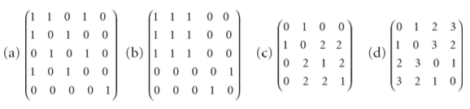

30. **(Nicoletti, 2018)** Seja $G$ um grafo simples e seja $A$ sua matriz de adjacência. Prove que as entradas na diagonal principal de $A^2$ fornecem os graus dos vértices de $G$. Esse fato continua válido se a condição de o grafo ser simples for removida?

31. **(Nicoletti, 2018)** Escreva a matriz de adjacência e a matriz de incidência para os grafos mostrados em (a) e (b), usando as ordenações de vértices e arestas dadas.
    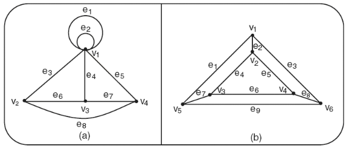

32. **(Nicoletti, 2018)** Use o processo de fusão para determinar se os grafos do Exercício 29, especificados por suas matrizes de adjacência, são conectados ou não. A cada passo, especifique o grafo correspondente e sua matriz de adjacência.

33. **(Nicoletti, 2018)** Construa a matriz de adjacência e de incidência do grafo mostrado no enunciado.
    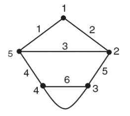

34. **(Nicoletti, 2018)** Desenhe o grafo cuja matriz de incidência é a fornecida no enunciado.
    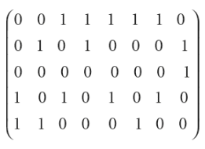

35. **(Nicoletti, 2018)** Se $G$ é um grafo sem loops, o que você pode dizer sobre a soma das entradas em:
- (a) Qualquer linha ou coluna da matriz de adjacência de $G$?
- (b) Qualquer linha da matriz de incidência de $G$?
- (c) Qualquer coluna da matriz de incidência de $G$?

36. **(Nicoletti, 2018)** Considere o grafo $G$ mostrado no enunciado:
    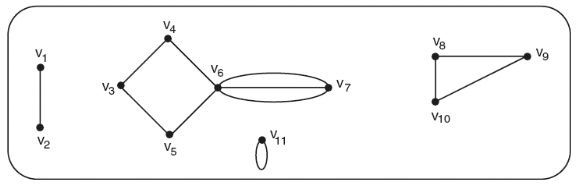
- (a) Os vértices $v_1$ e $v_2$ são incidentes? Explique.
- (b) Qual(is) vértice(s) de $G$ (se algum) é(são) adjacente(s) a si próprio(s)?
- (c) O vértice $v_3$ é adjacente ao vértice $v_6$? Explique.
- (d) O grafo $G$ é um grafo simples? Explique.
- (e) Encontre os graus de cada um dos vértices de $G$.

37. **(Nicoletti, 2018)** Pode um grafo ter vértices com graus $2,2,3,4,5,5,6,8$ e nenhum outro vértice? Justifique sua resposta.

38. **(Nicoletti, 2018)** Se um grafo tem vértices de graus $1,2,3,3,4,5$, quantas arestas ele tem? Justifique sua resposta.

39. **(Nicoletti, 2018)** Quantas arestas tem o grafo $K_{10}$?

40. **(Nicoletti, 2018)** Dê um exemplo de um grafo simples:
- (a) Que não tenha vértices com grau ímpar.
- (b) Que não tenha vértices com grau par.

41. **(Nicoletti, 2018)** Mostre que não existe um grafo $G$ cujos vértices tenham graus iguais a $2,3,3,4,4,5$.

42. **(Nicoletti, 2018)** Mostre que não existe um grafo simples $G$ cujos vértices tenham graus $1,3,3,3$. Pode existir um outro tipo de grafo com esses graus?

43. **(Nicoletti, 2018)** Se $m$ e $n$ são dois inteiros positivos, encontre um grafo $G$ com a propriedade de que todo vértice tem grau $m$ ou $n$.

44. **(Nicoletti, 2018)** O grafo completo $K_n$ é regular? Se for, qual o grau de $K_n$? Justifique sua resposta.

45. **(Nicoletti, 2018)** Desenhe os grafos bipartidos completos $K_{2,2}$, $K_{3,3}$ e $K_{4,5}$.

46. **(Nicoletti, 2018)** Encontre todos os subgrafos do grafo $G_1$ dado no enunciado.
    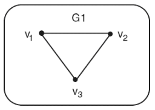

47. **(Nicoletti, 2018)** Dê um exemplo de:
- (a) Grafo regular simples de grau $1$ que não seja um grafo completo.
- (b) Grafo regular simples de grau $2$ que não seja um grafo completo.
- (c) Grafo regular simples de grau $3$ que não seja um grafo completo.

48. **(Nicoletti, 2018)** Dados os grafos a seguir, quais deles são bipartidos e quais não? Para os bipartidos, redesenhe-os de modo que fiquem evidentes os dois conjuntos de vértices.
    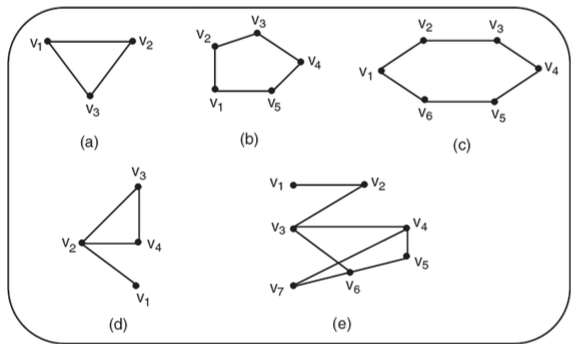

49. **(Nicoletti, 2018)** Um grafo tripartido $K_{r,s,t}$ consiste em três conjuntos de vértices (de tamanhos $r$, $s$ e $t$), com uma aresta unindo dois vértices se e somente se eles pertencem a conjuntos diferentes. Desenhe os grafos $K_{2,2,2}$ e $K_{3,3,2}$ e encontre o número de arestas de $K_{3,4,5}$.

50. **(Nicoletti, 2018)** Para o grafo $G$ mostrado no enunciado:
    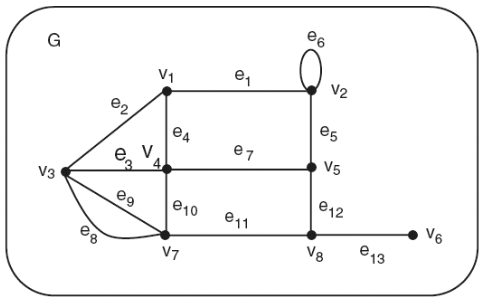
- (a) Encontre $G-U$, em que $U=\{v_1,v_3,v_5,v_7\}$.
- (b) Encontre $G-F$, em que $F=\{e_2,e_4,e_6,e_8,e_{10},e_{12}\}$.
- (c) Encontre $G[U]$, em que $U=\{v_2,v_3,v_4,v_7\}$.
- (d) Encontre $G[F]$, em que $F=\{e_1,e_2,e_8,e_{11}\}$.
- (e) Encontre o subgrafo $H$ de $G$ isomorfo a $K_3$.
- (f) Existe um subgrafo de $G$ isomorfo a $K_4$?
- (g) Qual é o grafo simples básico de $G$? De quantas maneiras diferentes ele pode ser obtido?
- (h) Qual é a interseção dos dois subgrafos encontrados nos itens (a) e (b)?
- (i) Qual é a união dos dois subgrafos encontrados em (c) e (d)?

51. **(Nicoletti, 2018)** Um grafo simples é chamado de autocomplementar se for isomorfo ao seu próprio complemento.
    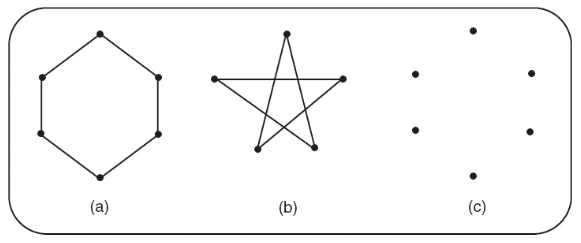
- (a) Quais dos grafos (a), (b) e (c) a seguir são autocomplementares?

52. **(Feofiloff, 2013)** Faça uma lista de todos os grafos que tenham {a,b,c} por conjunto de vértices. Faça a lista de modo que cada grafo apareça ao lado do seu complemento. (ETG: 1.1).

53. **(Feofiloff, 2013)** Faça uma figura de um $K_5$ e outra de um $\overline{K_5}$. Quantas arestas tem um $K_n$? E um $\overline{K_n}$? (ETG: 1.2).

54. **(Feofiloff, 2013)** A matriz de adjacências de um grafo $G$ é a matriz $A$ definida da seguinte maneira: para quaisquer dois vértices $u$ e $v$, $A[u,v]=1$ se $uv\in E_G$, e $A[u,v]=0$ em caso contrário. É claro que a matriz é indexada por $V_G\times V_G$. Escreva a matriz de adjacências do grafo definido no exemplo abaixo. Escreva a matriz de adjacências de um $K_4$. Qual a relação entre a matriz de adjacências de um grafo e a matriz de adjacências de seu complemento? (ETG: 1.3). 
    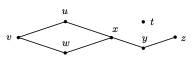 
    Figura 1.1: Grafo exemplo. Os vértices do grafo são t, u, v, w, x, y, z e as arestas são vw, uv, xw, xu, xy e yz. 

55. **(Feofiloff, 2013)** A matriz de incidências de um grafo $G$ é a matriz $M$ definida da seguinte maneira: para todo vértice $u$ e toda aresta $e$, $M[u,e]=1$ se $u$ é uma das pontas de $e$, e $M[u,e]=0$ em caso contrário. É claro que a matriz é indexada por $V_G\times E_G$. Escreva a matriz de incidências do grafo definido no exemplo da página 8. Escreva a matriz de incidências de um $K_4$. Quanto vale a soma de todos os elementos da matriz de incidências de um grafo? Qual a relação entre a matriz de incidências de um grafo e a matriz de incidências de seu complemento? (ETG: 1.4).

56. **(Feofiloff, 2013)** Os hidrocarbonetos conhecidos como alcanos têm fórmula química $C_pH_{2p+2}$, onde $C$ e $H$ representam átomos de carbono e hidrogênio, respectivamente. As moléculas de alcanos podem ser representadas por grafos. Faça uma figura de uma molécula de metano $CH_4$. Quantas moléculas diferentes de $C_3H_8$ existem? (ETG: 1.5).
    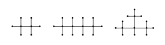 
    Figura 1.1: Etano ($C_2H_6$), butano ($C_4H_{10}$) e isobutano ($C_4H_{10}$). Os vértices em que incide uma só aresta representam átomos de hidrogênio ($H$); os demais representam átomos de carbono ($C$).

57. **(Feofiloff, 2013)** Seja $V$ o produto cartesiano $\{1,2,\ldots,p\}\times\{1,2,\ldots,q\}$. Digamos que dois elementos $(i,j)$ e $(i',j')$ de $V$ são adjacentes se $i=i'$ e $|j-j'|=1$, ou se $j=j'$ e $|i-i'|=1$. Essa relação de adjacência define o grafo grade $p$-por-$q$. Quantas arestas tem a grade $p$-por-$q$? Escreva as matrizes de adjacência e incidência de uma grade 4-por-5. (ETG: 1.6).
    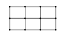 
    **Figura 1.2: Uma grade 3-por-4.** Cada vértice representa uma posição da grade e cada aresta liga apenas posições vizinhas na horizontal ou na vertical.

58. **(Feofiloff, 2013)** Dados números inteiros $p$ e $q$, seja $V$ o conjunto $\{1,2,3,\ldots,pq-2,pq-1,pq\}$. Digamos que dois elementos $k$ e $k'$ de $V$, com $k<k'$, são adjacentes se $k'=k+q$ ou se $k \bmod q \neq 0$ e $k'=k+1$. Essa relação de adjacência define um grafo com conjunto de vértices $V$. Faça uma figura do grafo com parâmetros $p=3$ e $q=4$. Faça uma figura do grafo com parâmetros $p=4$ e $q=3$. Qual a relação entre esses grafos e a grade definida no exercício 1.6? (ETG: 1.7).

59. **(Feofiloff, 2013)** O grafo dos movimentos da dama (ou grafo da dama) é definido em um tabuleiro $t$-por-$t$: os vértices são as casas e dois vértices são adjacentes se uma dama do xadrez pode ir de uma casa à outra em um só movimento. Faça uma figura do grafo da dama 4-por-4. Escreva as matrizes de adjacência e incidência desse grafo. Quantas arestas tem o grafo da dama 8-por-8? Quantas arestas tem o grafo da dama $t$-por-$t$? (ETG: 1.8).

60. **(Feofiloff, 2013)** O grafo do cavalo $t$-por-$t$ é definido assim: os vértices são as casas de um tabuleiro de xadrez com $t$ linhas e $t$ colunas; dois vértices são adjacentes se um cavalo pode saltar de um deles para o outro em um só movimento. Faça uma figura do grafo do cavalo 3-por-3. Escreva as matrizes de adjacência e incidência desse grafo. Quantas arestas tem o grafo do cavalo 8-por-8? Quantas arestas tem o grafo do cavalo $t$-por-$t$? (ETG: 1.9).
    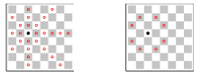 
    Figura 1.3: Tabuleiros de xadrez 8-por-8. A figura esquerda indica todos os vizinhos do vértice •no grafo da dama (veja exercício 1.8). A da direita indica todos os vizinhos do vértice •no grafo do cavalo

61. **(Feofiloff, 2013)** O grafo do bispo $t$-por-$t$ é definido assim: os vértices são as casas de um tabuleiro de xadrez com $t$ linhas e $t$ colunas; dois vértices são adjacentes se um bispo pode saltar de um deles para o outro em um só movimento. Faça uma figura do grafo do bispo 4-por-4. Escreva as matrizes de adjacência e incidência desse grafo. Quantas arestas tem o grafo do bispo 8-por-8? Quantas arestas tem o grafo do bispo $t$-por-$t$? (ETG: 1.10).

62. **(Feofiloff, 2013)** O grafo da torre $t$-por-$t$ é definido assim: os vértices são as casas de um tabuleiro de xadrez com $t$ linhas e $t$ colunas; dois vértices são adjacentes se uma torre pode saltar de um deles para o outro em um só movimento. Faça uma figura do grafo da torre 4-por-4. Escreva as matrizes de adjacência e incidência desse grafo. Quantas arestas tem o grafo da torre 8-por-8? Quantas arestas tem o grafo da torre $t$-por-$t$? (ETG: 1.11).

63. **(Feofiloff, 2013)** O grafo do rei $t$-por-$t$ é definido assim: os vértices são as casas de um tabuleiro de xadrez com $t$ linhas e $t$ colunas; dois vértices são adjacentes se um rei pode saltar de um deles para o outro em um só movimento. Faça uma figura do grafo do rei 4-por-4. Escreva as matrizes de adjacência e incidência desse grafo. Quantas arestas tem o grafo do rei 8-por-8? Quantas arestas tem o grafo do rei $t$-por-$t$? (ETG: 1.12).

64. **(Feofiloff, 2013)** O grafo das palavras é definido assim: cada vértice é uma palavra da língua portuguesa e duas palavras são adjacentes se diferem em exatamente uma posição. Por exemplo, rato e ralo são adjacentes, enquanto ralo e rota não são. Faça uma figura da parte do grafo definida pelas palavras `caiado, cavado, cavalo, girafa, girava, ralo, ramo, rata, rato, remo, reta, reto, rota, vaiado, varado, virada, virado, virava.` Escreva as matrizes de adjacência e incidência do grafo. (ETG: 1.13).

65. **(Feofiloff, 2013)** Para qualquer inteiro positivo $k$, um cubo de dimensão $k$ (ou $k$-cubo) é o grafo definido da seguinte maneira: os vértices são todas as sequências de $k$ bits; dois vértices são adjacentes se e somente se diferem em exatamente uma posição. Faça figuras dos cubos $Q_1$, $Q_2$ e $Q_3$. Escreva as matrizes de adjacência e incidência de $Q_3$. Quantos vértices tem $Q_k$? Quantas arestas tem $Q_k$? (ETG: 1.14)
    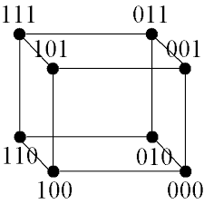 
    Figura 1.1: Exemplo do grafo 3-cubo ($Q_3$), com 8 vértices rotulados por sequências de 3 bits; duas sequências são adjacentes quando diferem em exatamente 1 bit.  

66. **(Feofiloff, 2013)** Seja $X=\{1,2,3,4,5\}$ e $V=X^{(2)}$ (o conjunto de todos os subconjuntos de $X$ com exatamente 2 elementos). Digamos que dois elementos $v$ e $w$ de $V$ são adjacentes se $v\cap w=\emptyset$. Essa relação define o grafo de Petersen. Faça uma figura do grafo. Escreva as matrizes de adjacência e incidência do grafo. Quantos vértices e quantas arestas tem o grafo? (ETG: 1.15).

67. **(Feofiloff, 2013)** Seja $V$ o conjunto de todos os subconjuntos de $\{1,2,\ldots,n\}$ que têm exatamente $k$ elementos, sendo $k\leq n/2$. Digamos que dois elementos $v$ e $w$ de $V$ são adjacentes se $v\cap w=\emptyset$. Essa relação define o grafo de Kneser $K(n,k)$. Em particular, $K(5,2)$ é o grafo de Petersen. Faça figuras de $K(n,1)$, $K(n,n)$, $K(n,n-1)$, $K(4,2)$, $K(5,3)$, $K(6,2)$ e $K(6,3)$. (ETG: 1.16).

68. **(Feofiloff, 2013)** O grafo dos estados do Brasil é definido assim: cada vértice é um dos estados da República Federativa do Brasil; dois estados são adjacentes se têm uma fronteira comum. Faça um desenho do grafo. Quantos vértices tem o grafo? Quantas arestas? (ETG: 1.17).

69. **(Feofiloff, 2013)** Considere as grandes cidades e as grandes estradas do estado de São Paulo. Digamos que uma cidade é grande se tem pelo menos 300 mil habitantes. Digamos que uma estrada é grande se tiver pista dupla (como a SP300, por exemplo). Digamos que duas grandes cidades são adjacentes se uma grande estrada ou uma concatenação de grandes estradas liga as duas cidades diretamente (isto é, sem passar por uma terceira grande cidade). Faça uma figura do grafo das grandes cidades definido por essa relação de adjacência. (ETG: 1.18).

70. **(Feofiloff, 2013)** Seja $V$ um conjunto de pontos no plano. Digamos que dois desses pontos são adjacentes se a distância entre eles é menor que 2. Essa relação de adjacência define o grafo dos pontos no plano (sobre o conjunto $V$). Faça uma figura do grafo definido pelos pontos abaixo. 
    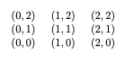 
   Escreva as matrizes de adjacência e incidência do grafo. (ETG: 1.19).

71. **(Feofiloff, 2013)** Dado um conjunto $V$, seja $E$ o conjunto definido da seguinte maneira: para cada par não ordenado de elementos de $V$, jogue uma moeda; se o resultado for cara, acrescente o par a $E$. O grafo $(V,E)$ assim definido é aleatório. Pegue sua moeda favorita e faça uma figura do grafo aleatório com vértices $1,\ldots,6$. Agora repita o exercício com uma moeda viciada que dá cara com probabilidade $1/3$ e coroa com probabilidade $2/3$. (ETG: 1.20).

72. **(Feofiloff, 2013)** Seja $S$ uma matriz quadrada de números inteiros. Suponha que as linhas de $S$ são indexadas por um conjunto $V$ e que as colunas são indexadas pelo mesmo conjunto $V$. O grafo da matriz $S$ é definido da seguinte maneira: o conjunto de vértices do grafo é $V$ e dois vértices $i$ e $j$ são adjacentes se $S[i,j]\neq 0$. O grafo de $S$ está bem definido? Que condições é preciso impor sobre a matriz para que o grafo esteja bem definido? (ETG: 1.21).

73. **(Feofiloff, 2013)** Suponha dados $k$ intervalos de comprimento finito, digamos $I_1,I_2,\ldots,I_k$, na reta real. Digamos que dois intervalos $I_i$ e $I_j$ são adjacentes se $I_i\cap I_j\neq\emptyset$. Essa relação define um grafo de intervalos com conjunto de vértices $\{I_1,I_2,\ldots,I_k\}$. Faça uma figura do grafo definido pelos intervalos $[0,2]$, $[1,4]$, $[3,6]$, $[5,6]$ e $[1,6]$. Escreva as matrizes de adjacência e incidência do grafo. (ETG: 1.22).

74. **(Feofiloff, 2013)** Seja $\preceq$ uma relação de ordem parcial sobre um conjunto finito $V$. Digamos que dois elementos distintos $x$ e $y$ de $V$ são adjacentes se forem comparáveis, ou seja, se $x\preceq y$ ou $y\preceq x$. Essa relação define o grafo de comparabilidade da relação $\preceq$. Faça uma figura do grafo de comparabilidade da relação usual de inclusão $\subseteq$ entre os subconjuntos de $\{1,2,3\}$. (ETG: 1.23).

75. **(Feofiloff, 2013)** Duas arestas de um grafo $G$ são adjacentes se têm uma ponta comum. Essa relação de adjacência define o grafo das arestas de $G$. De modo mais formal, o grafo das arestas (= line graph) de um grafo $G$ é o grafo $(E_G,A)$ em que $A$ é o conjunto de todos os pares de arestas adjacentes de $G$. O grafo das arestas de $G$ será denotado por $L(G)$. 
      - Faça uma figura de $L(K_3)$. 
      - Faça uma figura de $L(K_4)$. 
      - Escreva as matrizes de adjacência e incidência de $L(K_4)$. 
      - Quantos vértices e quantas arestas tem $L(K_n)$? 
      - Faça uma figura do grafo $L(P)$, sendo $P$ o grafo de Petersen (veja exercício E1.15). (ETG: 1.24). 
      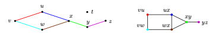

76. **(Feofiloff, 2013)** Uma pequena fábrica tem cinco máquinas (1, 2, 3, 4 e 5) e seis operários (A, B, C, D, E e F). A tabela especifica as máquinas que cada operário sabe operar: 
    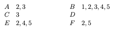 
    **Figura 1.4: Um grafo (esquerda) e o seu grafo das arestas (direita).** No grafo das arestas, cada vértice representa uma aresta do grafo original e há ligação entre dois desses vértices quando as arestas originais compartilham uma ponta. 
   Faça uma figura do grafo bipartido que representa a relação entre operários e máquinas. (ETG: 1.25).

77. **(Feofiloff, 2013)** Quantas arestas pode ter um grafo $\{U,W\}$-bipartido? (ETG: 1.26).

78. **(Feofiloff, 2013)** Quantas arestas tem um $K_{p,q}$? Quantas arestas tem um $\overline{K_{p,q}}$? (ETG: 1.27).

79. **(Feofiloff, 2013)** Faça uma figura de um $K_{3,4}$. Escreva as matrizes de adjacência e incidência de um $K_{3,4}$. Faça uma figura de uma estrela com 6 vértices. (ETG: 1.28).

80. **(Feofiloff, 2013)** É verdade que o grafo do cavalo no tabuleiro t-por-t é bipartido? (ETG: 1.29).

81. **(Feofiloff, 2013)** Que aparência tem a matriz de adjacências de um grafo bipartido? (ETG: 1.30).

82. **(Feofiloff, 2013)** A matriz da bipartição de um grafo $\{U,W\}$-bipartido é definida assim: cada linha da matriz é um elemento de $U$, cada coluna da matriz é um elemento de $W$, e no cruzamento da linha $u$ com a coluna $w$ temos 1 se $uw$ é uma aresta e 0 em caso contrário. Escreva a matriz da bipartição do grafo do exercício E1.25, adotando a bipartição $U=\{A,\ldots,F\}$ e $W=\{1,\ldots,5\}$. (ETG: 1.31).

83. **(Feofiloff, 2013)** Quais são os graus dos vértices de uma estrela (veja a seção 1.2)? (ETG: 1.32).

84. **(Feofiloff, 2013)** Se $G$ é um $K_n$, quanto valem $\delta(G)$ e $\Delta(G)$, isto é, grau mínimo e grau máximo de $G$? Quanto valem os parâmetros $\delta$ e $\Delta$ de um $K_{p,q}$? (ETG: 1.33).

85. **(Feofiloff, 2013)** Para r = 1,2,3, faça uma figura de um grafo r-regular com 12 vértices. (ETG: 1.34).

86. **(Feofiloff, 2013)** Quais são os graus dos vértices de uma molécula de alcano (veja exercício 1.5)? (ETG: 1.35).

87. **(Feofiloff, 2013)** Calcule os valores dos parâmetros $\delta$, $\Delta$ e $\mu$ no $k$-cubo (veja exercício 1.14) e no grafo de Petersen (veja exercício 1.15). (ETG: 1.36). 
   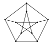 
   **Figura 1.6: Grafo de Petersen. Veja exercícios 1.15 e 1.36.** É um grafo com 10 vértices e 15 arestas, 3-regular, usado como exemplo clássico para analisar propriedades estruturais.

88. **(Feofiloff, 2013)** Calcule os valores dos parâmetros $\delta$ e $\Delta$ no grafo dos estados do Brasil (veja exercício 1.17). (ETG: 1.37).

89. **(Feofiloff, 2013)** Calcule os valores dos parâmetros $\delta$, $\Delta$ e $\mu$ no grafo da dama (veja exercício 1.8) e no grafo do cavalo (veja exercício 1.9). (ETG: 1.38).

90. **(Feofiloff, 2013)** Seja $A$ a matriz de adjacências (veja exercício 1.3) e $M$ a matriz de incidências (veja exercício 1.4) de um grafo $G$. Quanto vale a soma dos elementos da linha $v$ de $A$? Quanto vale a soma dos elementos da linha $v$ de $M$? (ETG: 1.39).

91. **(Feofiloff, 2013)** Seja $G$ um grafo $\{U,W\}$-bipartido. Suponha que $G$ é $r$-regular, com $r>0$. Mostre que $|U|=|W|$. (ETG: 1.40).

92. **(Feofiloff, 2013)** É verdade que todo grafo com pelo menos dois vértices tem dois vértices com o mesmo número de vizinhos? Em outras palavras, se um grafo tem mais de um vértice, é verdade que tem dois vértices distintos $v$ e $w$ tais que $|N(v)|=|N(w)|$? (Uma maneira informal de dizer isso: em toda cidade com pelo menos dois habitantes residem duas pessoas que têm exatamente o mesmo número de amigos na cidade?) (ETG: 1.41).

93. **(Feofiloff, 2013)** Mostre que, em todo grafo, a soma dos graus dos vértices é igual ao dobro do número de arestas. Ou seja, todo grafo $(V,E)$ satisfaz a identidade $\sum_{v\in V} d(v)=2|E|$. (ETG: 1.42).

94. **(Feofiloff, 2013)** Mostre que $\mu(G)=2m(G)/n(G)$ para todo grafo $G$. (ETG: 1.43).

95. **(Feofiloff, 2013)** Mostre que todo grafo $G$ tem um vértice $v$ tal que $d(v)\leq 2m(G)/n(G)$ e um vértice $w$ tal que $d(w)\geq 2m(G)/n(G)$. É verdade que todo grafo $G$ tem um vértice $x$ tal que $d(x)<2m(G)/n(G)$? (ETG: 1.44).

96. **(Feofiloff, 2013)** Mostre que, em qualquer grafo, tem-se $\delta \leq 2m/n \leq \Delta$. (ETG: 1.45).

97. **(Feofiloff, 2013)** Mostre que todo grafo com $n$ vértices tem no máximo $n(n-1)/2$ arestas. (ETG: 1.46).

98. **(Feofiloff, 2013)** Mostre que em qualquer grafo o número de vértices de grau ímpar é necessariamente par. (ETG: 1.47).

99.  **(Feofiloff, 2013)** Quantas arestas tem o grafo da dama 8-por-8 (veja exercício 1.8)? Quantas arestas tem o grafo da dama $t$-por-$t$? (ETG: 1.48).

100. **(Feofiloff, 2013)** Quantas arestas tem o grafo do cavalo 4-por-4 (veja exercício 1.9)? Quantas arestas tem o grafo do cavalo $t$-por-$t$? (ETG: 1.49).

101. **(Feofiloff, 2013)** Quantas arestas tem um grafo $r$-regular com $n$ vértices? (ETG: 1.50).

102. **(Feofiloff, 2013)** Quantas arestas tem o cubo de dimensão $k$? (ETG: 1.51).

103. **(Feofiloff, 2013)** Quantas arestas tem o grafo das arestas (veja exercício 1.24) de um grafo $G$? (ETG: 1.52).

104. **(Feofiloff, 2013)** Seja $\overline{G}$ o complemento de um grafo $G$. Calcule $\delta(\overline{G})$ e $\Delta(\overline{G})$ em função de $\delta(G)$ e $\Delta(G)$. (ETG: 1.53).

105. **(Feofiloff, 2013)** Seja $G$ um grafo tal que $m(G)>n(G)$. Mostre que $\Delta(G)\geq 3$. (ETG: 1.54).

106. **(Feofiloff, 2013)** Suponha que um grafo $G$ tem menos arestas que vértices, ou seja, que $m(G)<n(G)$. Mostre que $G$ tem (pelo menos) um vértice de grau $0$ ou (pelo menos) dois vértices de grau $1$. (ETG: 1.55).

107. **(Feofiloff, 2013)** Escolha dois números naturais $n$ e $k$ e considere o seguinte jogo para dois jogadores, A e B. Cada iteração do jogo começa com um grafo $G$ que tem $n$ vértices. No início da primeira iteração tem-se $E_G=\emptyset$. Em cada iteração ímpar (primeira, terceira, etc.), o jogador A escolhe dois vértices não adjacentes $u$ e $v$ e acrescenta $uv$ ao conjunto de arestas do grafo. Em cada iteração par (segunda, quarta, etc.), o jogador B faz um movimento análogo: escolhe dois vértices não adjacentes $u$ e $v$ e acrescenta $uv$ ao conjunto de arestas do grafo. O primeiro jogador a produzir um grafo $G$ tal que $\delta(G)\geq k$ perde o jogo. Problema: determinar uma estratégia vencedora para A e uma estratégia vencedora para B. (ETG: 1.56).

## Fontes
1. NICOLETTI, Maria do Carmo. *Fundamentos da teoria dos grafos*. [S.l.: s.n.], [s.d.]. Acesso em: 21 fev. 2026.
2. FEOFILOFF, Paulo. *Exercícios de teoria dos grafos*. São Paulo: Instituto de Matemática e Estatística, Universidade de São Paulo, 2013. Endereço: https://www.ime.usp.br/~pf/grafos-exercicios/. Acesso em: 21 fev. 2026.
